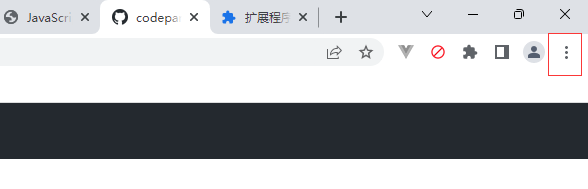
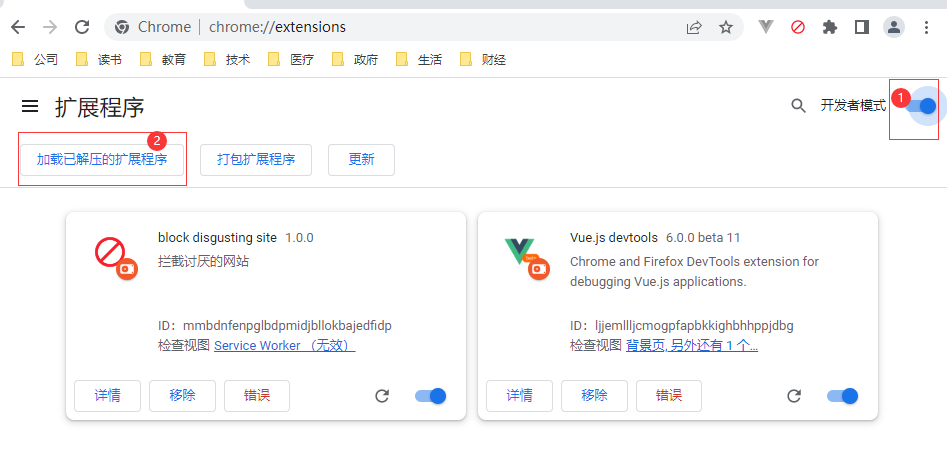
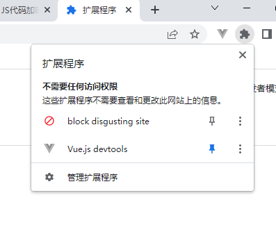
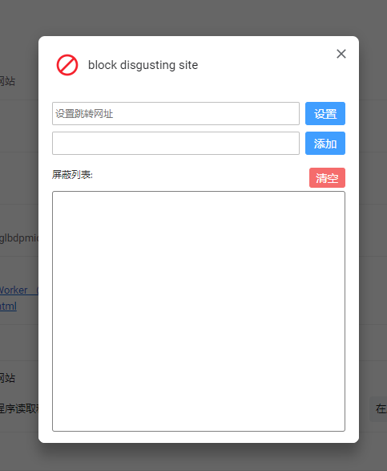

# 网站拦截器 chrome 插件

开发一个网站拦截器，拦截一些令人讨厌的网站。

## 安装

从仓库中下载文件，[gitee 地址](https://gitee.com/wangpeng126_2009/blocksite)，[github 地址](https://github.com/codepandy/blocksite)

打开谷歌浏览器，点击右上角的三个点，然后选择“扩展程序”===》“管理扩展程序”，

打开扩展程序的管理界面后，打开开发者模式，点击“加载已解压的扩展程序”，选择下载的文件夹即可。

## 图标始终显示

点击扩展图标，把图钉点亮即可。

## 右键添加

对讨厌的网站可以右键快速添加到拦截列表。在网页上右键，可以看到“拦截该网站”的 menu，点击即可拦截当前网站，并且跳转到指定的网站，默认是百度。

## 配置阻止的网址

在图标上右键，点击“选项”可以手动添加要拦截的网站和默认跳转网址。

